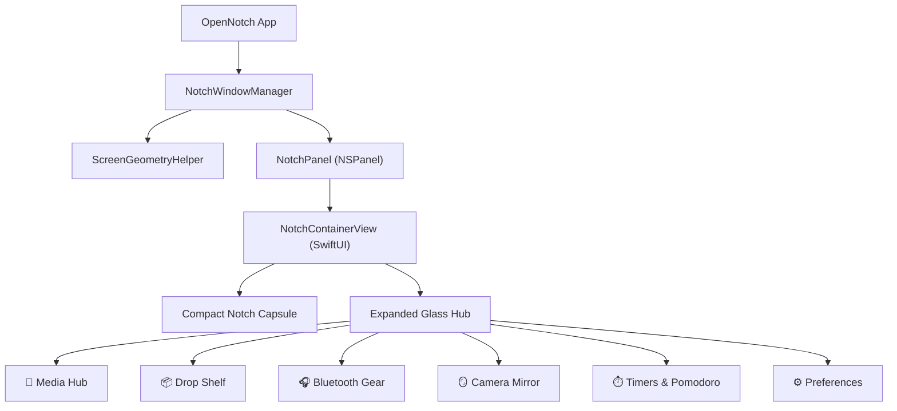

# 🏝️ OpenNotch

> **The Ultimate Open-Source macOS Notch & Dynamic Island Hub.**  
> Built with **Swift 6**, **SwiftUI**, and **AppKit** for macOS Sonoma (14.0+) & Sequoia (15.0+).

[](https://github.com/mdrealofficial/opennotch/releases/latest)
[](https://apple.com/macos)
[](https://swift.org)
[](LICENSE)
[](CONTRIBUTING.md)

---

## ✨ Features (100% Feature Parity & Beyond)

| Feature | Description |
| :--- | :--- |
| 🪄 **Hardware Notch Snapping** | Auto-detects physical MacBook notch insets and blends seamlessly. |
| 🏝️ **Dynamic Floating Island** | Elegant floating capsule fallback for external monitors and notch-less Macs. |
| 🎵 **Media Player & Visualizer** | Live status for **Apple Music**, **Spotify**, and browser playback (YouTube/Chrome/Safari), animated equalizer, and scrubbing. |
| 📦 **Drop Shelf (AirDrop & Stash)** | Stash files, view sizes, copy paths, reveal in Finder, or drag out to apps. |
| 🪞 **Camera Mirror Widget** | Instant webcam preview directly in the notch before video meetings. |
| ⏱️ **Timer & Stopwatch** | Live Pomodoro & countdown timers with real-time countdown badge in the compact notch. |
| 🎧 **Bluetooth Accessories Hub** | Real-time monitoring of paired/connected devices (AirPods, Magic Mouse, Keyboard, iPhone, Mac) with live battery levels and connect toggles. |
| ⚡️ **Pipelines & Shortcuts Runner** | 1-click execution for macOS Shortcuts, screenshot capture, appearance toggle, and scripts. |
| 💻 **Developer HUD (CPU, RAM, Uptime)** | Live CPU load, RAM usage, Battery health, Terminal launcher, and Unix timestamps. |
| 📅 **Calendar & Scratchpad** | Daily meeting glance and persistent temporary notes scratchpad. |
| 🧩 **Open-Source NotchWidget Plugin API** | Easily build custom widgets with the open `NotchWidget` Swift protocol. |

---

## 📊 OpenNotch vs. NotchNook Comparison

| Feature | NotchNook (Closed Source) | OpenNotch (Open Source) |
| :--- | :---: | :---: |
| **Physical Notch & Floating Island Snapping** | ✅ | ✅ |
| **Media Player & Live Spectrum Visualizer** | ✅ | ✅ |
| **Drop Shelf & File Stashing** | ✅ | ✅ |
| **Camera Mirror Check** | ✅ | ✅ |
| **Live Timers & Pomodoro** | ✅ | ✅ |
| **Connected Bluetooth Devices & Battery** | ✅ | ✅ |
| **Shortcuts & Pipelines Runner** | ✅ | ✅ |
| **Calendar Glance & Notes Scratchpad** | ✅ | ✅ |
| **💻 Developer HUD (CPU, RAM, Uptime)** | ❌ | **✅ (Exclusive)** |
| **🧩 Open-Source `NotchWidget` Plugin API** | ❌ | **✅ (Exclusive)** |
| **100% Free & Open Source (MIT)** | ❌ *(Paid)* | **✅ (Free / MIT)** |

---

## 🛠️ Architecture



---

## 🚀 Building and Running Locally

### Prerequisites
- macOS 14.0 (Sonoma) or newer
- Xcode 15.0+ / Swift 6 toolchain

### Quick Start
```bash
# Clone the repository
git clone https://github.com/mdrealofficial/opennotch.git
cd opennotch

# Build the project
swift build

# Run OpenNotch
swift run
```

---

## 📄 License

This project is licensed under the **MIT License** - see the [LICENSE](LICENSE) file for details.
